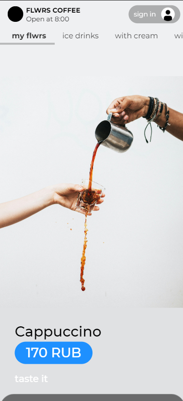
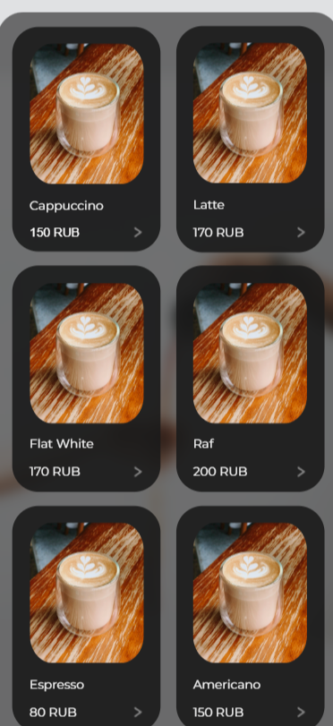
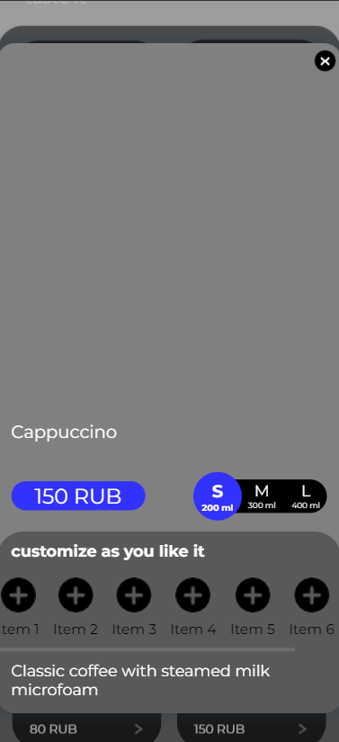
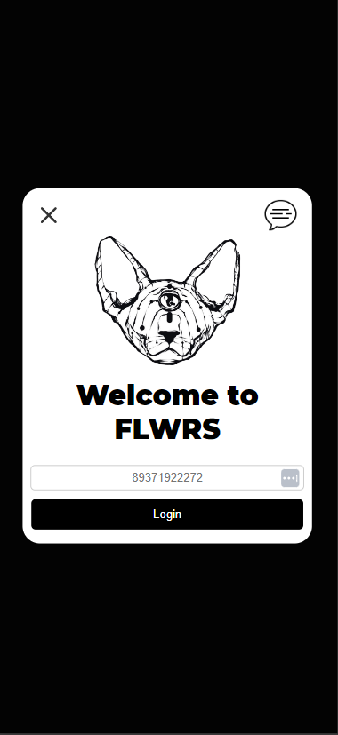

# **FLWRS**:cat:
The page is needed for user authorization - the phone number and name are entered (~~yes, the parameters are the most insecure for identification, but it is better not to identify them in the database~~). However php code present:
```php
    if ($_SERVER["REQUEST_METHOD"] == "POST") {
        //$firstName = $_POST['firstName'];/*FName='$firstName' AND*/ 
        $phoneNumber = $conn->real_escape_string($_POST['phoneNumber']);//the usual code for linking a SQL database and a php page
        $sql = "SELECT * FROM (name of ur table in SQL) WHERE Num='$phoneNumber'";

    ...
```
## reg.php<br>
This code is not visible to the user, but we need it to understand it. On the page, there is a connection between the ***QuickResto API*** and the ***SQL*** database:
```php
    $url = 'API_URL'; //making a GET request
    $username = 'API_LOGIN';
    $password = 'API_PASS';
    $ch = curl_init($url);
    curl_setopt($ch, CURLOPT_RETURNTRANSFER, true);
    curl_setopt($ch, CURLOPT_HTTPHEADER, array(
        'Accept: application/json',
        'Connection: keep-alive',
        'Content-Type: application/json',
        'Authorization: Basic ' . base64_encode($username . ':' . $password)
    ));
    ...
```
```php
    ...
    $customerGroupName = isset($customer['customerGroup']['name']) ? $customer['customerGroup']['name'] : null;
        
        $filteredCustomer = [ // we collect the necessary information from the API and save it to an array
            'firstName' => $customer['firstName'],
            'phone' => $customer['contactMethods'][0]['value'] ?? null,
            'createdTime' => $customer['createTime'],
            'id' => $customer['id'],
            'customerGroupName' => $customerGroupName,
            'ledgerBalance' => $ledgerBalance
        ];
        
        $filteredData[] = $filteredCustomer;
    ...
```
```php
    $sql = "INSERT INTO persons (FName, Num, createdTime, Id, GroupB, Bonus) 
            VALUES ('$firstName', '$phone', '$createdTime', '$id', '$customerGroupName', '$ledgerBalance')"; //We establish a connection with the SQL database again and take the data from the pre-assembled array and enter it into the table
```
## si.php<br>
The meaning of the file is the same as in the past, only if it saved information about users and their information, then this one saves information about drinks
```php
    $url = 'API_URL';
    $objectIds = [30130, ...]; // the algorithms and, in fact, the code are identical to the previous file, only here I wrote down the ID of all drinks in an array so that further relevant information about them would be displayed on the site
    $username = 'API_LOGIN';
    $password = 'API_PASSWORD';
    $prices = []
    ...
```
## site.php<br>
The semantic load of this file is identical to the first one. There is no php code here, but there is a design.<br>
Below is the appearance of the site:<br>
&nbsp;&nbsp;&nbsp;&nbsp;&nbsp;&nbsp;&nbsp;&nbsp;&nbsp;<br><br>&nbsp;&nbsp;&nbsp;&nbsp;&nbsp;&nbsp;&nbsp;&nbsp;&nbsp;<br><br>
